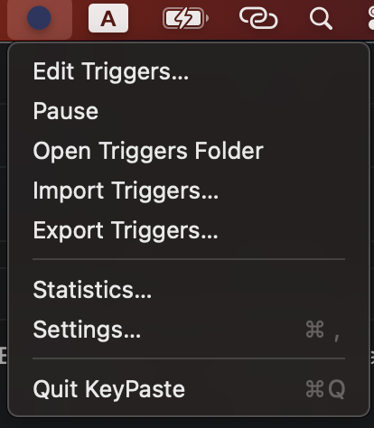
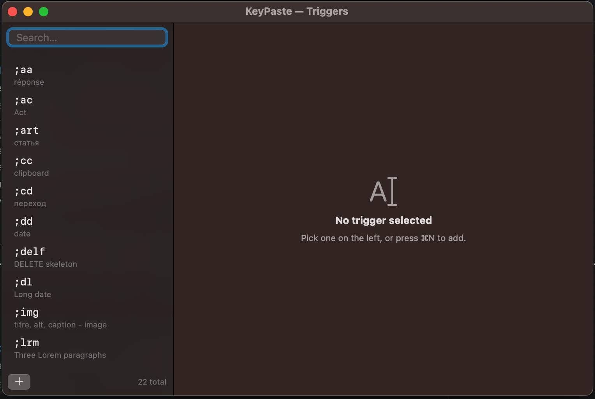
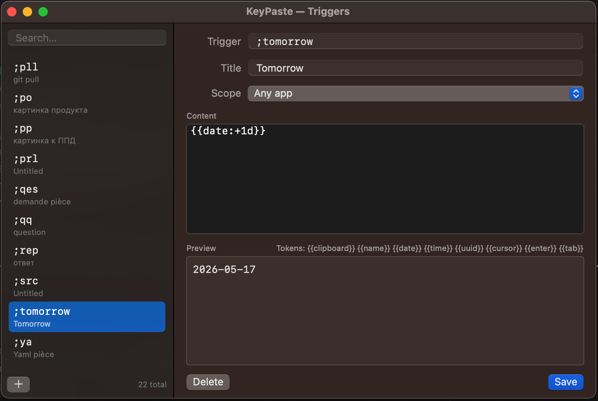
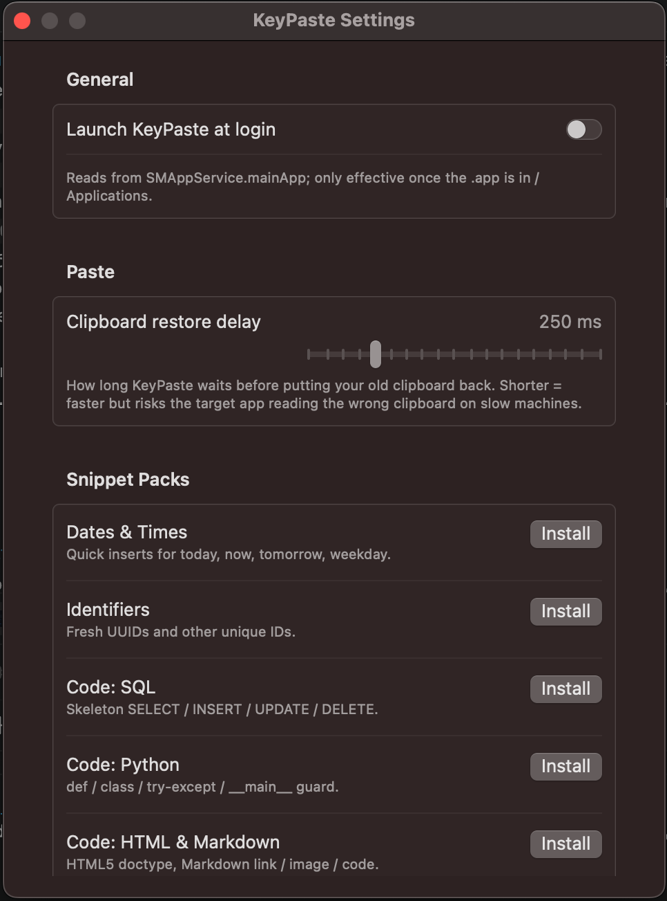
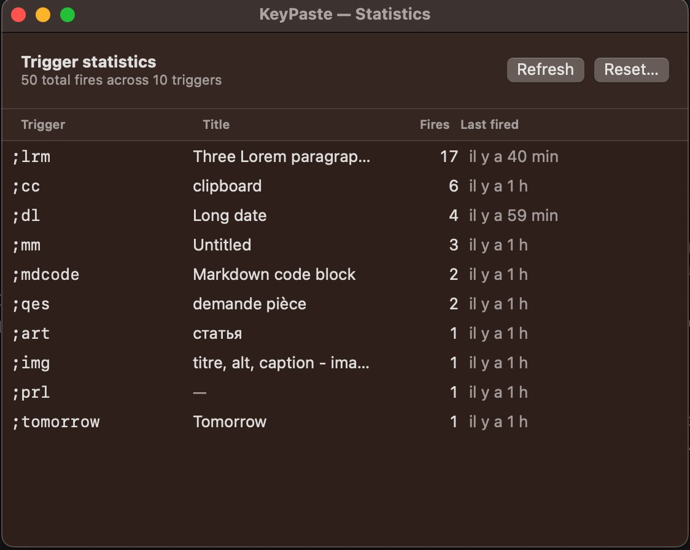

# KeyPaste

**A native, privacy-respecting text expander for macOS.** Type a short trigger
anywhere in any app — KeyPaste replaces it with a longer snippet, optionally
filled with live data (clipboard, date, your name, fresh UUID, …).

[](LICENSE)
[](#requirements)
[](#build-from-source)
[](#tests)

<p align="center">
  
</p>

---

## Screenshots

| Trigger editor | Edit a trigger |
|---|---|
|  |  |

| Settings | Statistics |
|---|---|
|  |  |

---

## Why one more text expander?

Most macOS text expanders are paid (atext, TextExpander, TypeIt4Me).
KeyPaste is:

- **Free, forever.** AGPLv3 — open source, no business model behind it.
- **Local-first.** Your triggers live in a plain JSON file on your disk.
  Nothing leaves your Mac.
- **Minimal.** One menu-bar icon, one editor window, no account, no sync
  server, no telemetry.
- **Hackable.** Pure Swift / SwiftPM, ~3 K LOC. Read it in an afternoon.

## Features

- 🚀 **Instant fire** — expansion happens the moment your typed buffer
  matches a trigger. No need to press space.
- ✍️ **Templates** — `{{clipboard}}`, `{{date}}`, `{{time}}`, `{{uuid}}`,
  `{{name}}`, `{{datetime}}`, `{{weekday}}`, relative dates
  (`{{date:+1d}}`), custom formats (`{{date:yyyy-MM}}`).
- 🎯 **Cursor placement** — `{{cursor}}` parks the caret at a specific
  position in multi-line snippets.
- ⏎ **Post-paste keys** — `{{enter}}` and `{{tab}}` press Return/Tab
  after the paste lands. Great for password + Enter, or form fields.
- 🪪 **Per-app scope** — bind a trigger to a single application
  (`addr` → work address in Mail, home address in Messages).
- 📚 **Snippet packs** — one-click install of ready-made packs:
  Dates & Times, Identifiers, SQL skeletons, Python, HTML/Markdown,
  Lorem Ipsum.
- 📊 **Fire statistics** — per-trigger counts and last-fired timestamps,
  resettable from the menu.
- 💾 **Import/export** — JSON round-trip. Backup and share your library.
- 🔒 **Secure input aware** — the engine drops everything while macOS
  reports a focused secure field (password prompts, sudo, lock screen).
- 🛡️ **Pause toggle** — quick on/off from the menu-bar dot (filled when
  running, hollow when paused).

## Quick start

### 1. Install

Download `KeyPaste.dmg` from the [latest release](https://github.com/colizej/keypaste/releases/latest),
open it, drag `KeyPaste.app` to `/Applications`, and launch it.

> First launch may show *"KeyPaste can't be opened because it is from an
> unidentified developer"*. KeyPaste isn't notarized yet (no Apple
> Developer ID). To open it: right-click the app → **Open** → confirm.
> You'll only need to do this once.

### 2. Grant Accessibility

Open **System Settings → Privacy & Security → Accessibility** and enable
`KeyPaste`. macOS only loads this permission at process start, so quit
and relaunch KeyPaste after toggling it on.

### 3. Add your first trigger

Click the KeyPaste icon in the menu bar → **Edit Triggers…** → press `⌘N`.
Fill in:

- **Trigger** — what you'll type, e.g. `;email`
- **Content** — what KeyPaste types in its place, e.g. `me@example.com`
- **Save** with `⌘↩`

Now type `;email` in any app — it expands instantly.

> **Tip:** prefix triggers with `;` (or `xx`, `qq`, …) so they don't fire
> mid-word. `email` would expand inside `emailing` because we fire on
> any suffix match — see [Firing model](#firing-model) below.

## Template tokens

Anything inside `{{ }}` in your snippet's content is a token. Unknown
tokens are left as-is so typos are visible.

| Token | Replaces with | Example output |
|---|---|---|
| `{{clipboard}}` | Current clipboard text | `https://example.com` |
| `{{name}}` | Your macOS user short name | `colizej` |
| `{{date}}` | Today, `yyyy-MM-dd` | `2026-05-16` |
| `{{date:long}}` | Today, long format | `May 16, 2026` |
| `{{date:iso}}` | Today, ISO 8601 | `2026-05-16T19:30:00Z` |
| `{{date:+1d}}` | Tomorrow (`+/-N` `d`/`w`/`m`/`y`) | `2026-05-17` |
| `{{date:yyyy-MM}}` | Custom DateFormatter pattern | `2026-05` |
| `{{time}}` | `HH:mm` | `19:30` |
| `{{datetime}}` | `yyyy-MM-dd HH:mm` | `2026-05-16 19:30` |
| `{{weekday}}` | Day name | `Saturday` |
| `{{uuid}}` | Fresh UUID v4 | `5C8B9...` |
| `{{cursor}}` | Caret lands here after paste | *(invisible)* |
| `{{enter}}` | Presses Return after the paste | *(invisible)* |
| `{{tab}}` | Presses Tab after the paste | *(invisible)* |

Example — a letter template with cursor positioning:

```
Hi {{cursor}},

Best regards,
{{name}}
```

After expansion, the caret lands right after `Hi ` ready for the
recipient's name.

Example — auto-submit a password:

```
mySecret123{{enter}}
```

## Snippet packs

Open **Settings… → Snippet Packs** to install bundled packs in one
click. Existing triggers are never overwritten — duplicates are
skipped silently.

- **Dates & Times** — `;today`, `;now`, `;tomorrow`, `;weekday`, …
- **Identifiers** — `;uuid`
- **Code: SQL** — `;sel`, `;ins`, `;upd`, `;delf`
- **Code: Python** — `;pydef`, `;pyclass`, `;pytry`, `;pymain`
- **Code: HTML & Markdown** — `;html5`, `;mdlink`, `;mdimg`, `;mdcode`
- **Lorem Ipsum** — `;lorem`, `;lorem3`

## Per-app scope

In the trigger editor, the **Scope** dropdown limits a trigger to a
single application. `Any app` (the default) means it fires everywhere.

A common pattern: two triggers with the same key, different scope.

| Trigger | Scope | Content |
|---|---|---|
| `;addr` | `com.apple.mail` | `Acme Inc, 1 Main St, …` |
| `;addr` | `com.apple.MobileSMS` | `Home: 42 Garden Ln` |

Typing `;addr` resolves to whichever address the focused app expects.

## Keyboard shortcuts

| Shortcut | Action |
|---|---|
| `⌘N` | New trigger (in editor) |
| `⌘F` | Focus the search field (in editor) |
| `⌘⌫` | Delete selected trigger (in editor) |
| `⌘↩` | Save current trigger (in editor) |
| `⌘,` | Open Settings… (from menu bar) |
| `⌘Q` | Quit KeyPaste |

## Firing model

KeyPaste fires the moment your typed buffer ends with a trigger string
— no boundary key required. This is the user-requested behaviour, and
it means trigger names that are prefixes of common words will fire
mid-word.

In practice, prefix every trigger with `;` (or `qq`, `xx`, …) to avoid
false fires inside ordinary typing.

## Privacy

- **Nothing leaves your Mac.** No telemetry, no analytics, no
  auto-update server (yet — Sparkle is on the roadmap and will be
  opt-in transparent when added).
- **Key contents are never logged.** Logger writes structured events
  (e.g. *"Loaded 42 triggers"*, *"Pack 'sql' installed"*) but never
  the keys themselves.
- **Secure input is respected.** When `IsSecureEventInputEnabled()`
  reports a focused password field, sudo prompt, or lock screen, the
  engine flushes its buffer and short-circuits.
- **Clipboard is restored.** KeyPaste uses Cmd+V under the hood and
  briefly takes over the system clipboard, then restores your previous
  contents after the paste lands.

Storage layout:

```
~/Library/Application Support/KeyPaste/
├── triggers.json   ← your triggers (plain JSON, schema v2)
├── stats.json      ← fire counts and last-fired timestamps
└── triggers.legacy.json.bak   ← one-time backup if migrated from v1
```

## Requirements

- macOS 13 Ventura or later
- Accessibility permission (system dialog on first run)

x86_64 and Apple Silicon are both supported.

## Build from source

```bash
git clone https://github.com/colizej/keypaste.git
cd keypaste/app
./scripts/build-app.sh
open dist/KeyPaste.app
```

Requires Xcode 14.2 or later (Swift 5.7+).

### Tests

```bash
cd app
swift test
```

127 tests cover the storage layer (atomic writes, legacy v1
migration, ULID), the engine (buffer, matcher, template, instant-fire
flow), the system layer (event-tap classification, paste strategy
contract), and snippet pack installation. UI views (SwiftUI) and
Accessibility-dependent code (event tap creation) are excluded — they
need a running app and TCC trust.

## Contributing

Contributions welcome — code, snippet packs, bug reports, docs.

### Submitting a snippet pack

Snippet packs are defined in
[`app/Sources/KeyPaste/Storage/SnippetPacks.swift`](app/Sources/KeyPaste/Storage/SnippetPacks.swift).
For now, add new packs by PR to that file. A separate
`keypaste-snippets` community repo is on the roadmap so packs can
ship independently of the app.

### Code

- Open a discussion before large changes.
- Keep PRs focused.
- Run `swift test` locally.
- Don't add telemetry.
- Don't log key contents.

## Roadmap

- [x] **v0.1** — Native engine, editor, snippet packs, stats,
      import/export, per-app scope. *(this release)*
- [ ] **v0.2** — Sparkle auto-update + first signed release.
- [ ] **v0.3** — `{{selection}}` token via the Accessibility API.
- [ ] **v0.4** — Community snippet library (separate `keypaste-snippets`
      repo, browsable from the app).
- [ ] **v1.0** — Apple Developer ID + notarization.

## License & brand

Source code: **GNU Affero General Public License v3.0 or later**
(AGPL-3.0-or-later). See [LICENSE](LICENSE).

The **"KeyPaste" name and icon** are reserved as unregistered
trademarks of the project owner. Forks must rename before
redistribution. See [NOTICE.md](NOTICE.md) for the full rationale.

In plain English:

- You can use, study, modify, and share the source.
- Modified redistributions (including SaaS hosting) must release their
  source under AGPLv3.
- You can't ship your fork *under the name KeyPaste* or with the
  KeyPaste icon.

## Credits

Built by [Colin Joseph](https://github.com/colizej) (and a fair amount
of pair-programming with Claude). The previous Rust + Swift hybrid
lives, archived, at
[keypaste-rust-legacy](https://github.com/colizej/keypaste-rust-legacy).

Inspired by atext, TextExpander, and Espanso.
